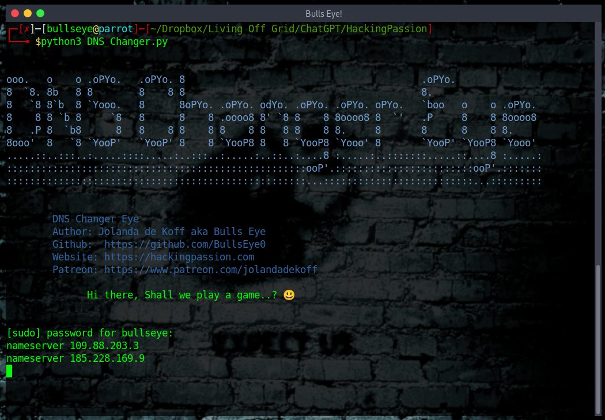

# DNS Changer Eye

## Description
This Python script aims to enhance your online privacy and security by automatically rotating your DNS settings at a set interval (default is every 5 minutes). The script uses a pre-defined list of reputable DNS servers. The full article explaining the importance of DNS in ethical hacking can be found at [HackingPassion.com](https://hackingpassion.com/why-your-dns-settings-could-make-or-break-your-hacking-career/).

## Why is this Important?
Understanding and tweaking your DNS settings is crucial in the realm of ethical hacking. For a detailed guide on why DNS settings are so important, check out this comprehensive article on [HackingPassion.com](https://hackingpassion.com/why-your-dns-settings-could-make-or-break-your-hacking-career/).



****

## Features
- Automatically rotates DNS settings
- Utilizes a list of 64 reputable DNS servers
- Enhances online privacy and security

****

## Requirements
- Python 3.x
- Linux OS (specifically designed for Parrot OS)

****

## Installation Steps:

1. **Clone the repository:**
```bash
git clone https://github.com/BullsEye0/DNS-Changer-Eye.git
cd DNS-Changer-Eye
```

2. **Create a virtual environment (recommended):**
```bash
python3 -m venv venv
source venv/bin/activate  # On Windows: venv\Scripts\activate
```

3. **Install dependencies (if required):**
```bash
pip3 install -r requirements.txt
```

****

## How to use DNS Changer Eye
```bash
python3 DNS_Changer_Eye.py
```

****

## Manual Verification
Open a new terminal and run:
```bash
cat /etc/resolv.conf
```
This will show you the current DNS settings.

****

## Monitoring
Use network monitoring tools like Wireshark to confirm DNS queries are being sent to the correct servers.

****

## List of DNS Servers
The script includes the following DNS servers:
- Cloudflare: 1.1.1.1, 1.0.0.1
- Quad9: 9.9.9.9, 149.112.112.112
- OpenDNS: 208.67.222.222, 208.67.220.220
- Verisign: 64.6.64.6, 64.6.65.6
- UncensoredDNS: 91.239.100.100, 89.233.43.71
- CleanBrowsing: 185.228.168.9, 185.228.169.9
- Yandex: 77.88.8.8, 77.88.8.1
- AdGuard: 176.103.130.130, 176.103.130.131
- DNS Advantage: 156.154.70.1, 156.154.71.1
- Norton: 199.85.126.10, 199.85.127.10
- GreenTeam: 81.218.119.11, 209.88.198.133
- SafeDNS: 195.46.39.39, 195.46.39.40
- SmartViper: 208.76.50.50, 208.76.51.51
- Dyn: 216.146.35.35, 216.146.36.36
- FreeDNS: 37.235.1.174, 37.235.1.177
- Alternate DNS: 198.101.242.72, 23.253.163.53
- puntCAT: 109.69.8.51
- Quad101: 101.101.101.101, 101.102.103.104
- FDN: 80.67.169.12, 80.67.169.40
- OpenNIC: 185.121.177.177, 185.121.177.53
- AS250.net: 195.10.46.179, 212.82.225.7
- Orange: 194.168.4.100, 194.168.8.100
- SingNet: 203.122.222.6, 203.122.223.6
- Level3: 209.244.0.3, 209.244.0.4
- Belgian ISP Telenet: 109.88.203.3, 62.197.111.140
- Sprintlink: 194.38.104.56, 194.38.105.56
- Vodafone NZ: 203.118.141.194, 203.118.141.195
- Vodafone NZ 2: 203.79.252.114, 203.79.252.115

****

## I also want to make you aware that:
* This was written for educational purposes and pentest only.
* The author will not be responsible for any damage ..!
* The author of this tool is not responsible for any misuse of the information.
* You will not misuse the information to gain unauthorized access.
* This information shall only be used to expand knowledge and not to cause malicious or damaging attacks.
* Performing any hacks without written permission is illegal ..!
* Use it responsibly and ensure you have permission to change DNS settings on the network you're operating on.

****

# Contact with the coder
Social Networks - Connect

* Website [HackingPassion.com](https://hackingpassion.com)

* [Facebook Personal](https://www.facebook.com/profile.php?id=100069546190609)

* [linkedin](https://www.linkedin.com/in/jolandadekoff/)

* [Youtube](https://www.youtube.com/@HackingPassion)

* [Facebook Page](https://www.facebook.com/ethical.hack.group)

* [Facebook Group](https://www.facebook.com/groups/ethical.hack.group/)


***

## 💻 Support this project

If you find this tool useful, consider supporting my work:  
[❤️ Sponsor BullsEye](https://github.com/sponsors/BullsEye0)

Get the full hands-on course:  
**[Ethical Hacking Complete Course – Zero to Expert](https://www.udemy.com/course/ethical-hacking-complete-course-zero-to-expert/?couponCode=BULLSEYE)**

(supports me directly as your instructor!)

Professional penetration testing. Zero to Expert.  
✅ Kali Linux + Parrot OS  
✅ Real-world hacking scenarios  
✅ All major tools & techniques  
✅ Beginner-friendly  

HACKING IS NOT A HOBBY, BUT A WAY OF LIFE 🎯

***

## Donate

I have developed DNS Changer Eye because I am passionate about this. 
Donations are one of the many ways to support what I do.

[Donate](https://hackingpassion.com/donate/)

BAT: Use [Brave](https://brave.com/bul891) and donate on any of my web pages/profiles

[](https://www.paypal.com/cgi-bin/webscr?cmd=_s-xclick&hosted_button_id=R96YN2PUS8V8W)
